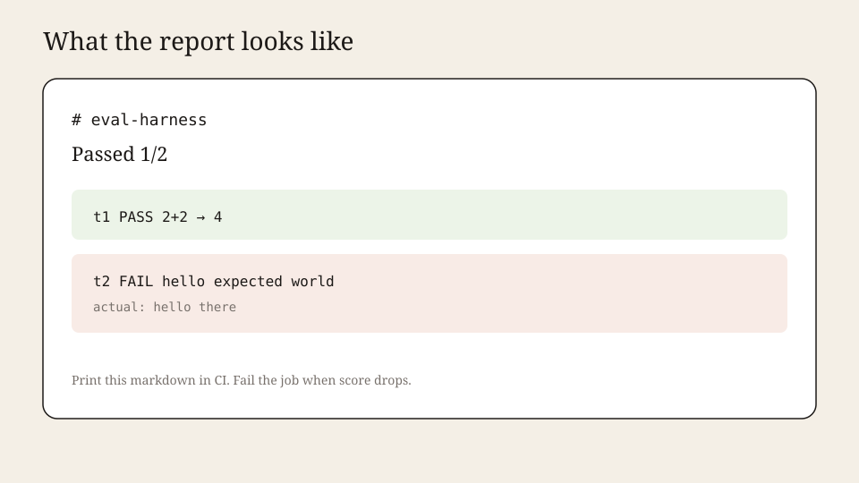
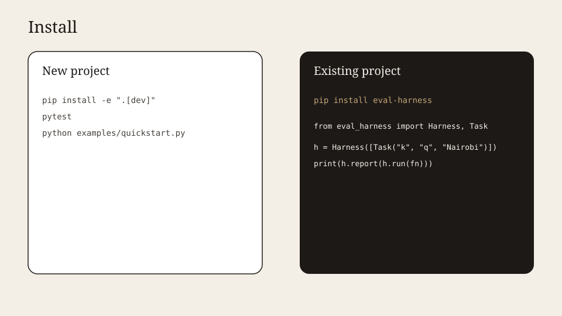

# eval-harness

A frozen list of tasks, three judges (`exact`, `contains`, `regex`), a markdown report for CI.

**Live:** [github.com/vk-ai/eval-harness](https://github.com/vk-ai/eval-harness)



## Why this exists

Promptfoo and Inspect are platforms. This is a **Python object**. No YAML, no network, no dashboard. Drop it next to your agent and fail the PR when score drops.

| | eval-harness | Typical stacks |
|---|---|---|
| Config | `Task(...)` in code | YAML / cloud |
| Judges | exact, contains, regex | LLM-as-judge by default |
| Output | Markdown string | Vendor UI |
| Deps | 0 | CLI + API key |

Design: **strategy** judges (`Callable[[str, str], bool]`), immutable `Task`, `Harness` as a **facade** over run / score / report.

## Install — new project



```bash
git clone https://github.com/vk-ai/eval-harness.git
cd eval-harness
python -m venv .venv && source .venv/bin/activate
pip install -e ".[dev]"
pytest
python examples/quickstart.py
```

## Install — existing project

```bash
pip install eval-harness
```

```python
from eval_harness import Harness, Task, contains

h = Harness([Task("kenya", "Capital of Kenya?", "Nairobi", contains)])
print(h.report(h.run(lambda p: "Nairobi")))
```

## Trajectory-aware judging

A correct final answer can still hide a bad path (forbidden tools, over-long
loops, dangerous details). Return a `Trajectory` and attach path judges:

```python
from eval_harness import (
    Step,
    Trajectory,
    TrajectoryHarness,
    TrajectoryTask,
    contains,
    forbid_actions,
    max_steps,
)

h = TrajectoryHarness([
    TrajectoryTask(
        "kenya",
        "Capital of Kenya?",
        "Nairobi",
        contains,
        path_judges=(forbid_actions("shell"), max_steps(4)),
    )
])

def agent(prompt: str) -> Trajectory:
    return Trajectory(
        steps=(Step("retrieve", "wiki"), Step("llm", "answer")),
        final="Nairobi",
    )

print(h.report(h.run(agent)))
```

Built-ins: `forbid_actions`, `require_actions`, `max_steps`, `forbid_detail_substr`.
Outcome and path are scored separately; `ok` requires both. Still zero deps /
no LLM-as-judge.

MIT. Python 3.10+.
